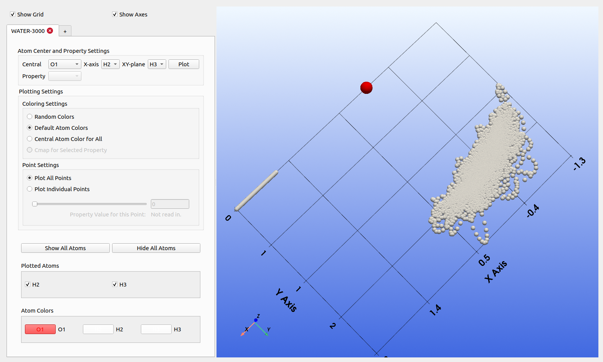
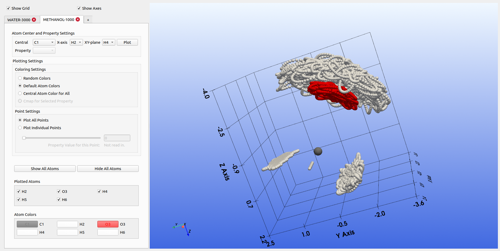
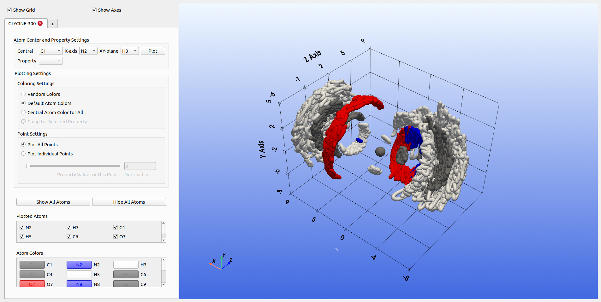

# ALFVisualizer

The ALFvisualizer is used to center a trajectory on an atom by defining a local coordinate frame, containing a central atom, x-axis atom, and xy-plane atom. These three atoms define the ALF (Atomic Local Frame) with which other atoms are mapped to. More information about the ALF can be found here: https://doi.org/10.1021/ct500565g, https://doi.org/10.1002/jcc.27477.

Open application with `python alfvis_main_window.py`. Once the app opens, you can use the `+` sign to load in a `.xyz` trajectory file which to visualize. Energies or other properties relating to the specific configuration can also be read in from the comment line in the xyz file. If they are read in, a cmap checkbox can be ticked which displays a colormap of the properties.

Note that this is a very rudimentary implementation, with one of the purposes for this code being for me to learn more about developing graphical user interfaces, and the other being to very easily visualize multiple datasets at a time in one place.

## Loading in Data
Data can be loaded with the `+` tab which opens up the file explorer from which a trajectory `.xyz` file can be selected.

## Installation
Refer to the `requirements.txt` file for dependencies. This is tested to work with Python 3.10.12

## Files 
`alfvis_main_window.py` - contains the main application window code
`alfvis_new_dataset.py` - contains code that runs every time a new dataset is loaded
`main_window.ui` - Contains the user interface for the main window
`new_dataset.ui` - Contains the user interface for any new datasets that are loaded

The `.ui` files can be opened with Qt Creator.

Make sure the .xyz file you are reading in is in the form like

```
       4
 i =        0
  N        -2.2607932254        2.0945786163        0.0088077425
  H        -1.2164693277        2.0953397253        0.0040872488
  H        -2.6066449314        1.3328784610       -0.6163600241
  H        -2.6066479938        3.0138887811       -0.3460000529
       4
 i =        1
  N        -2.2632436218        2.0965535042        0.0083647927
  H        -1.2271833269        2.0900488087       -0.0078358832
  H        -2.5831176250        1.3176832550       -0.6042803346
  H        -2.5850039914        3.0066032814       -0.3402081673
       4
 i =        2
  N        -2.2655738644        2.0983784715        0.0079114939
  H        -1.2390034750        2.0849513037       -0.0198694922
  H        -2.5593871255        1.3043635538       -0.5917204616
  H        -2.5634208124        2.9987283195       -0.3349821297
```

If you want system properties to be read in, add them to the comment line of the xyz file. This enables the cmap checkbox. Below is an example where properties are added to the comment line:

```
    6
i = 0 properties_error = {'iqa': {'H3': 0.48027911613971774, 'H5': 0.47734247998413054, 'O1': 0.29983578701175284, 'H6': 0.09937493248939769, 'O4': 0.07082311741183128, 'H2': 0.22618446822119234}}
O       0.00000000       0.00000000       0.00000000
H       0.96866215       0.00000000       0.00000000
H      -0.21396297       0.95285364       0.00000000
O       2.37921807      -1.16204804       2.04465958
H       2.95606298      -0.43589128       1.73318650
H       2.52677782      -0.91462853       2.97013203
    6
i = 1 properties_error = {'iqa': {'H3': 0.4198285614026961, 'H5': 0.05832058887803903, 'O1': 0.22788361203798477, 'H6': 0.5002542116818383, 'O4': 0.23284171959681865, 'H2': 0.22398961267328132}}
O       0.00000000       0.00000000       0.00000000
H       0.95381396       0.00000000       0.00000000
H      -0.19592956       0.97745489       0.00000000
O      -1.89713263      -0.36202378      -2.39431016
H      -1.94689270       0.11818630      -3.26952905
H      -1.15816150       0.14088836      -1.97281205
    6
i = 2 properties_error = {'iqa': {'H3': 0.28074079927317536, 'H5': 0.4820170993604812, 'O1': 1.4112608315118447, 'H6': 0.006834997985553248, 'O4': 0.4913517298278406, 'H2': 0.7228575583622224}}
O       0.00000000       0.00000000       0.00000000
H       0.98006036       0.00000000       0.00000000
H      -0.30104042       0.90913852       0.00000000
O       2.56651027      -1.12459474       0.96314789
H       2.02373754      -0.60403459       1.55577750
H       2.75109967      -1.85091601       1.56052776
```

## Options
- Random Colors: Plot atoms with random colors
- Default Colors: Plot atoms with default colors
- Plot Cmap: If properties are read in from the .xyz file, this makes a cmap of all the plotted points.
- Plot Individual Point: Only 1 points is displayed at a time. Use the slider or write in box to go to specific point. Starts from 0. This cannot be used with cmap. Note that this is very slow when there are many geometries because of the current implementation.
Note that the color boxes can be used to change the color of the separate atoms, however these will **not** be saved if you choose another color setting.
- Remove/show some atoms using checkboxes for every atom.
- Ability to load in multiple datasets at once (which will be shown overlapping on one pyvista plot).

## Examples:

Below are examples of plots for a few systems:

### Water Monomer:



### Methanol:



### Glycine:




